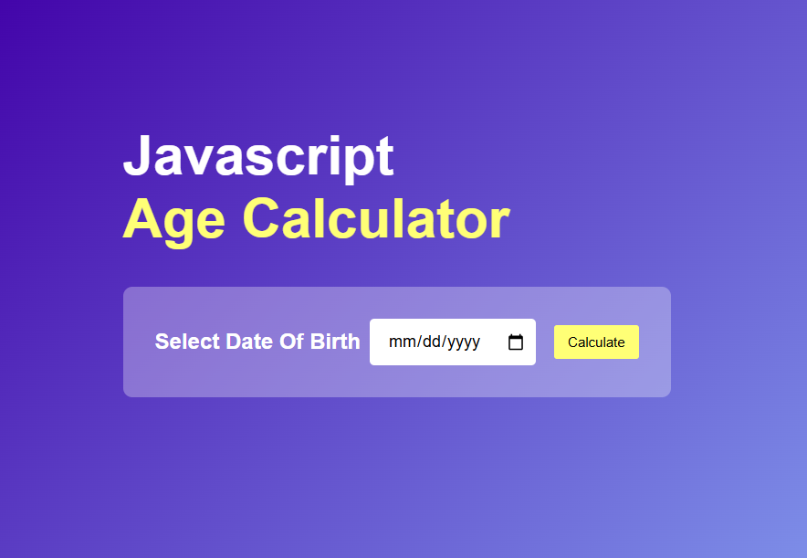
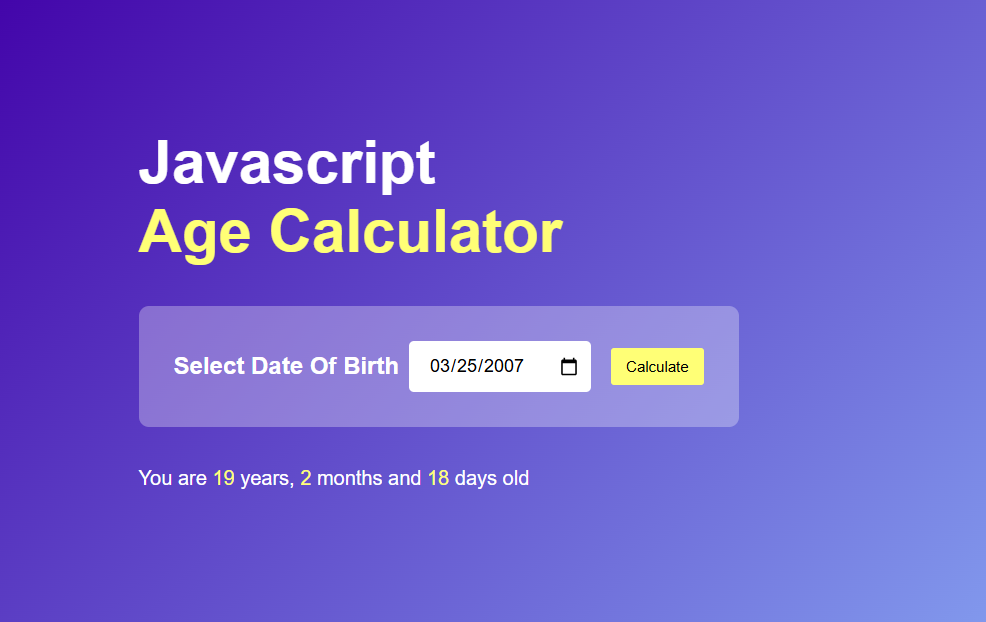

# 🎂 Age Calculator

A responsive **Age Calculator Web App** built using **HTML, CSS, and JavaScript**. It calculates a user's exact age in **years, months, and days** based on the selected date of birth.

---

## 🚀 Live Demo

https://your-demo-link-here

---

## 📸 Preview



---

## ✨ Features

- 📅 Select date of birth using a date picker
- 🎯 Calculates exact age in:
  - Years
  - Months
  - Days
- 🚫 Prevents selecting future dates
- 💻 Responsive and clean user interface
- ⚡ Instant age calculation
- 🎨 Modern gradient design

---

## 🛠️ Technologies Used

- HTML5
- CSS3
- JavaScript (Vanilla JS)

---

## ⚙️ How It Works

1. Open the application.
2. Select your **Date of Birth**.
3. Click the **Calculate** button.
4. The app instantly displays your age in **years, months, and days**.

---

## 💡 Future Improvements

- Display next birthday countdown
- Show age in total days, weeks, and hours
- Dark/Light mode
- Calculate age at a specific date
- Improved animations
- Better mobile responsiveness

---

## 🤝 Contributing

Contributions, suggestions, and improvements are always welcome.

1. Fork this repository
2. Create a new branch

```
git checkout -b feature-name
```

3. Commit your changes

```
git commit -m "Add new feature"
```

4. Push to your branch

```
git push origin feature-name
```

5. Open a Pull Request

---

## ⭐ Support

If you like this project, don't forget to **Star ⭐ the repository**.

---

## 👨‍💻 Author

**Zain Ul Abidin**


GitHub: https://github.com/zain-dev-ai-ml

---

